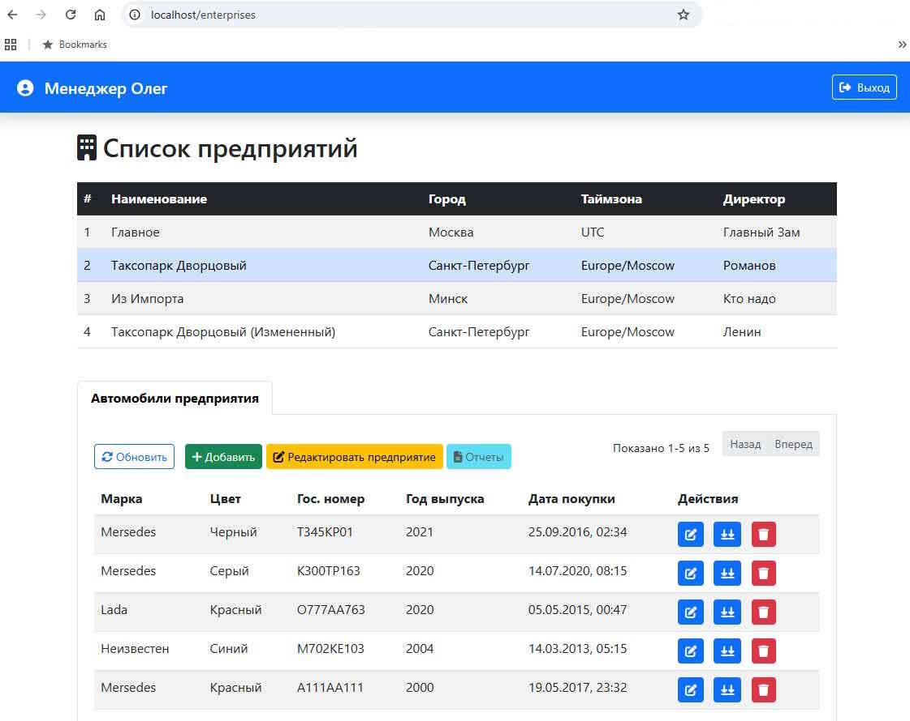
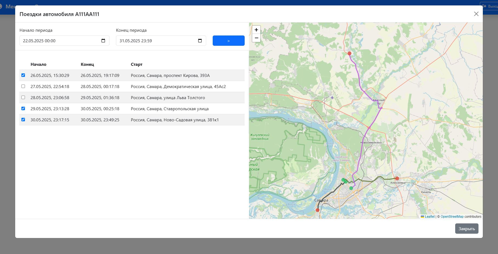
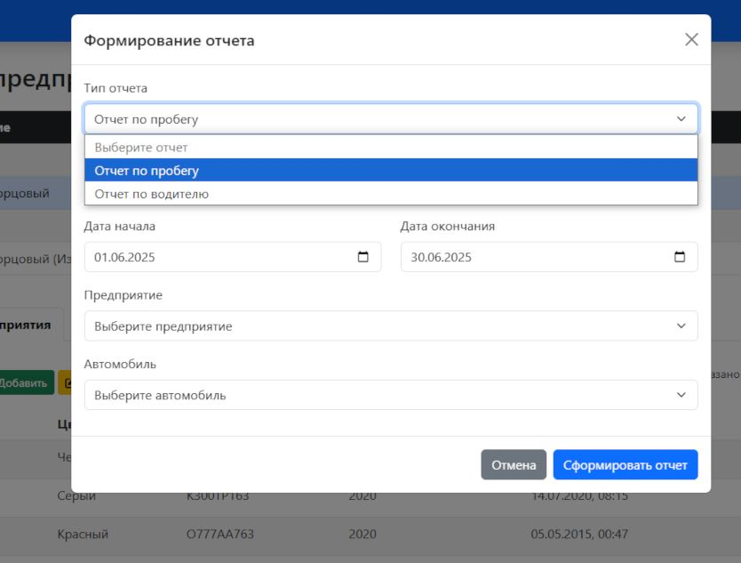
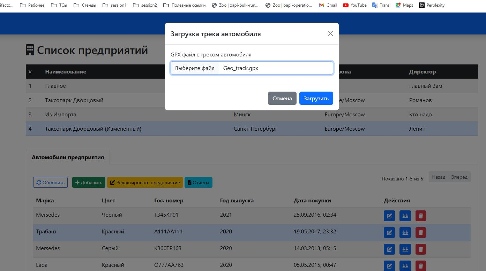
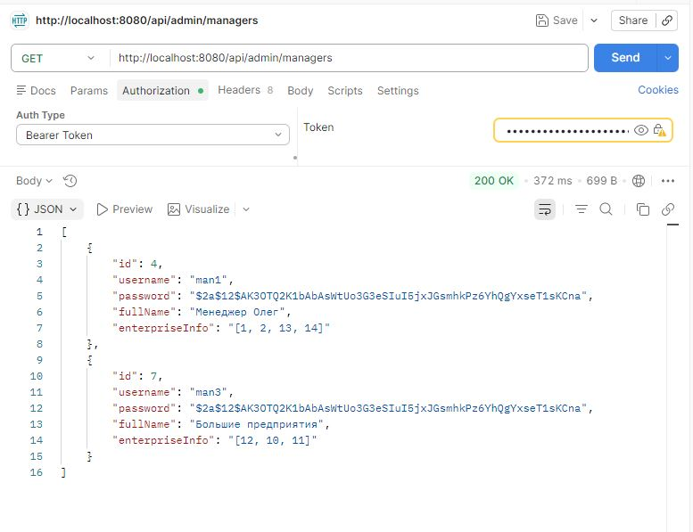
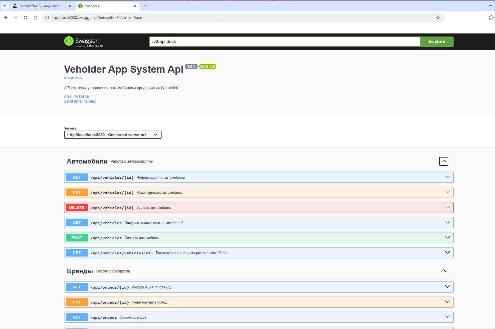
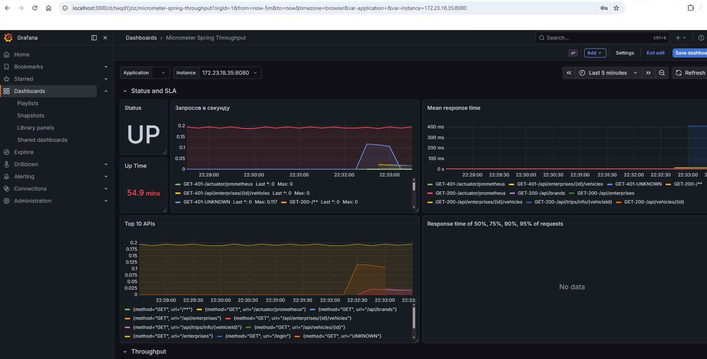
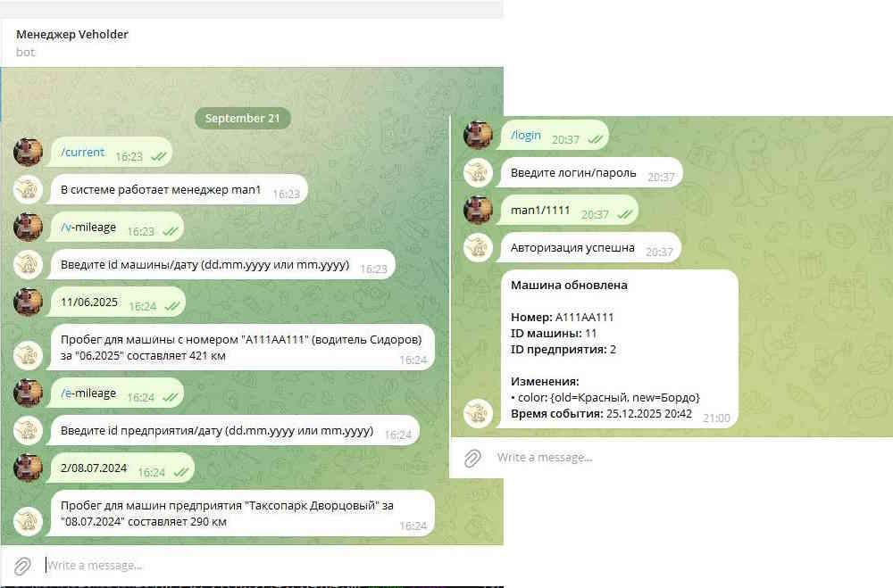

# Veholder
[](https://www.java.com/)
[](https://spring.io/)
[](https://www.postgresql.org/)
[](https://www.docker.com/)
[](https://kafka.apache.org/)
[](https://prometheus.io/)
[](https://grafana.com/)
[](https://swagger.io/)
***
Система управления автопарком в предприятиях.
Позволяет управлять списком предприятий, менеджеров и машин, отслеживать перемещение транспорта и получать аналитические отчеты.
Проект построен на базе классической многослойной (трехуровневой) архитектуры и рассчитан на обработку больших объемов данных о перемещениях автомобилей.

## Содержание
- [Основные возможности](#основные-возможности)
- [Технологический стек](#технологический-стек)
- [Архитектура](#архитектура-и-производительность)
- [Скриншоты](#скриншоты)
- [API Docs](#API-Docs)
- [Deployment](#deployment)
- [Docker](#docker)

## Основные возможности
- Управление предприятиями, автомобилями и водителями.
- Разграничение доступа менеджеров к данным по предприятиям.
- Загрузка/выгрузка поездок в формате GPX, визуализация маршрутов на карте.
- Генерация отчетов по пробегу автомобилей и занятости водителей по выбранным периодам.
- Возможность гибкого добавления иных аналитических отчетов в систему. 
- Поддержка экспорта/импорта данных в форматах JSON и CSV по всем сущностям.
- Отдельный микросервис для оповещения менеджеров об изменениях в их автопарке.

## Технологический стек
- Core: Java 21, Spring Boot 3.4.3
- БД: PostgreSQL
- Geo-сервисы: LeafLet (визуализация), Yandex Geocoder 
- Мониторинг: Prometheus + Grafana (настройка алертов через Alertmanager на Email/Telegram)
- Interface: REST API, Thymeleaf, Bootstrap, Telegram-bot (для быстрого получения основной информации)

## Архитектура и производительность
Проект реализован в трехуровневой архитектуре (Data, Business, API Layers) с вынесением логики уведомлений в микросервис.
Проведено нагрузочное тестирование (Read: 2 krps, Write: 1.5 krps)

## API Docs
Документация на API автоматически генерируется Swagger. После запуска приложения доступна по пути http://localhost:8080/swagger-ui/index.html
### Основные endpoints
```
GET|POST|PUT api/enterprises - работа с предприятиями

GET|POST|PUT api/vehicles - работа с автомобилями

GET|POST|PUT api/drivers - работа с водителями

GET|POST api/reports - генерация отчетов

GET|POST api/tracks - работа с треками автомобилей

GET|POST api/trips - работа с поездками автомобилей
```

## Deployment
### Запуск деплоя
Для автоматического развертывания используйте скрипт (запуск из основного каталога приложения):
```
chmod +x deploy.sh
./deploy.sh
```
### Основные хосты в рамках приложения
| Сервис           | Адрес | Описание                           |
|:-----------------| :--- |:-----------------------------------|
| **App**          | [localhost:8080](http://localhost:8080) | Основной интерфейс и логин         |
| **Swagger**      | [localhost:8080/swagger-ui/index.html](http://localhost:8080/swagger-ui/index.html) | Интерактивная документация API     |
| **Grafana**      | [localhost:3000](http://localhost:3000) | Дашборды мониторинга (admin/admin) |
| **Prometheus**   | [localhost:9090](http://localhost:9090) | База данных метрик                 |
| **Alertmanager** | [localhost:9093](http://localhost:9093) | Панель управления алертами         |

📲 Telegram bot: @VeholderMainBot.

## Скриншоты
##### Главный экран. Список предприятий и автомобилей.

##### Поездки автомобиля за период.

##### Аналитичекие отчеты по автомобилям

##### Загрузка треков

##### REST выдача

##### Swagger Docs

##### Мониторинг (Grafana)

##### Telegram bot


## Docker
Образ системы для тестового развертывания доступен на Docker Hub:
- App: docker pull alexeybos/veholder:latest
- DB: docker pull alexeybos/veholder-db:latest

Демонстрационные (тестовые) пользователи:

|Логин|Пароль|
|:-----------------|:---|
|man1|1111|
|man3|1111|

#Java #SpringBoot #PostgreSQL #GPX #GIS #LeafLet #Prometheus #Grafana #Microservices #HighLoad #Geocoder #RestAPI #Swagger #Thymeleaf
